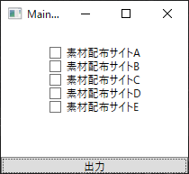

# 進捗状況
これから先開発を進めるための、環境構築が完了しました。  
まだ機能はひとつも実装されていません。  

具体的な開発情報は、Twitterでお知らせしています。  
[Twitter](https://twitter.com/terapotan)

## 素材ライセンスチェッカーをダウンロードするには?
### GoogleDriveからダウンロードする
以下のリンクにある**prototype-1.zip**というファイルをダウンロードしてください。

[ダウンロードリンク](https://drive.google.com/drive/folders/1zvJZ9vuz9R5oZNAQoeyTELV5kBcdi7sN?usp=sharing)

## ソフトのインストール方法
特別なインストールの操作は必要ありません。ダウンロードして、すぐソフトを起動することが出来ます。
# 素材ライセンスチェッカーって何だ
## なんで作ったの?
ソフトウェアを作るには、どうしてもイラストや音楽といった他の人が作った素材が必要になります。  
「いや、俺は全部自分で作るんだ!」と意気込んでも……膨大な作業量に圧倒されることでしょう。  

幸いにも、今は無料で素材を配布してくださる方が多くいらっしゃいます。
ですが、他の人が作った素材ですから、「利用規約」というものを守らないといけません。例えば次のようなものです。

> 当サイトで配布している素材を用いる際には、クレジット等に「サイト名」と「サイトのURL」を必ず記載してください。
> 
> 使用する素材は、一作品につき50点までです。

この利用規約というのは、サイトごとで違う内容になっています。使っている素材配布サイトが一つだけなら、まだ人力で管理できるかもしれませんが、5,10……と増えていくと、もう人力で管理するのは、不可能に近くなります。  

具体的に言うと、次のようなことが起こるでしょう。  

- 今どの素材配布サイト使ってるんだっけ?
- あれ?確か、この素材配布サイト何か禁止事項書いてあった気がするけど……何だっけ?
- えーと、このサイトは「サイト名」と「URL」記載必須?で、このサイトは「名前」と「URL」記載必須?――あぁぁぁ!面倒くさーい!!
- ……本当に利用規約守って使ってるよな?大丈夫だよな?素材の数多すぎて、もうわけわからん。

このような面倒を解決するのが**素材ライセンスチェッカー**です。

# ソフトに関する質問・意見
バグや不具合の報告は、以下のGoogleFormをお使い下さい。
ソフトウェアのバージョンは、ソフトウェアに同梱されているREADME.txtに書かれています。

[バグ・不具合報告](https://forms.gle/ngCaCjegDqKVT9gc6)  

それ以外の意見・感想は、下のGoogleFormから送ってください。  

[意見・感想](https://forms.gle/HAQido7dD4eZaUkc8)  

メールアドレスを明かしたくない場合は、このページからGitHubの機能を使ってイシューを送るか、私のTwitterへ連絡してください。  

Twitter:https://twitter.com/terapotan
  
# ライセンス
MITライセンスで配布しています。  
詳細は、[LICENSE](./LICENSE)をご覧下さい。
# リリース名
1.0.0やprototypeなど、リリースにつけられる名前の意味については[こちら](./AboutVersion.md)をご覧ください。