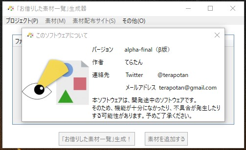

# β版公開！

β版を公開しました！詳細については、以下のリンクからご覧ください。

[詳細ページ](https://terapotan.hatenablog.jp/entry/MaterialLicenseCheckerVer2)

（名称が変わっていますが、同じソフトです）
## 試作版からの更新点
1. プロジェクト作成機能を追加しました。
   1. 一つのソフトで複数のソフトのライセンスを管理できるようになります。
2. 配布サイトの選択をプルダウンメニューから追加できるようにしました。
   1. 試作版は手動入力でした。
3. 素材配布元を一覧で表示できるようにしました。また、素材配布元の追加や削除、編集を行えるようにしました。
4. その他使いやすくするための様々な変更を行いました。

# このバージョンの素材ライセンスチェッカーをダウンロードするには?
## GoogleDriveからダウンロードする
以下のリンクにある**alpha-final.zip**というファイルをダウンロードしてください。

[ダウンロードリンク](https://drive.google.com/drive/u/2/folders/1Ovn9N6ZFQ7WtMGye-B0cxLVX_Dg0rID1)

## ソフトのインストール方法
特別なインストールの操作は必要ありません。ダウンロードして、zipファイルを解凍することで、すぐソフトを起動することが出来ます。

## このリポジトリはビルドできません
ソースコードを公開してはいますが、著作権の関係上、ソフトに使用している画像や音声のファイルをアップロード出来ないため、リポジトリをクローンしてビルドすることが出来ません。  

ソフトに機能を追加したいときは、下のフォームやイシューから、機能追加の要望を送ってください。
# ソフトに関する質問・意見
バグや不具合の報告は、以下のGoogleFormをお使い下さい。
ソフトウェアのバージョンは、ソフトウェアに同梱されているREADME.txtに書かれています。

[バグ・不具合報告](https://forms.gle/ngCaCjegDqKVT9gc6)  

それ以外の意見・感想は、下のGoogleFormから送ってください。  

[意見・感想](https://forms.gle/HAQido7dD4eZaUkc8)  

メールアドレスを明かしたくない場合は、このページからGitHubの機能を使ってイシューを送るか、私のTwitterへ連絡してください。  

Twitter:https://twitter.com/terapotan
  
# ライセンス
MITライセンスで配布しています。  
詳細は、[LICENSE](./LICENSE.md)をご覧下さい。
# リリース名
1.0.0やprototypeなど、リリースにつけられる名前の意味については[こちら](./AboutVersion.md)をご覧ください。