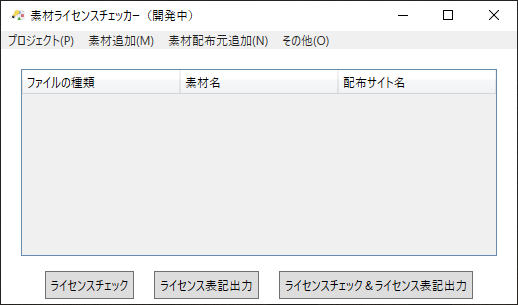

# 進捗

1. UIを大幅に変更しました。なお、完成したのは外観だけで、機能は実装されていません。
   1. その影響で、素材追加機能が正常に動作しません。次か、その次のリリースで追加される予定です。
2. 試作版で存在した、テキストボックスに何も入力されないバグを解消しました。

# このバージョンの素材ライセンスチェッカーをダウンロードするには?
## GoogleDriveからダウンロードする
以下のリンクにある**alpha-3.zip**というファイルをダウンロードしてください。

[ダウンロードリンク](https://drive.google.com/drive/u/2/folders/1Ovn9N6ZFQ7WtMGye-B0cxLVX_Dg0rID1)

## ソフトのインストール方法
特別なインストールの操作は必要ありません。ダウンロードして、zipファイルを解凍することで、すぐソフトを起動することが出来ます。

# 試作版公開!

素材ライセンスチェッカーの試作版をVectorにて公開しました!  
ダウンロード先へは、下のリンクから飛ぶことが出来ます。  

[ダウンロード先](https://www.vector.co.jp/soft/winnt/util/se521816.html)

**注意:本試作版では、素材を追加ウィンドウ中の参照ボタンを押してファイルを選択しても、テキストボックスに何も入力されないバグがあります。本バージョンでは、この項目の内容は動作に影響を与えないため、適当な値を入力してください。**

このソフトの詳しい情報は、以下の記事でご覧ください。  
[紹介記事](https://terapotan.hatenablog.jp/entry/MaterialLicenseChecker)

具体的な開発情報は、Twitterでもお知らせしています。  
[Twitter](https://twitter.com/terapotan)

# 素材ライセンスチェッカーって何だ
## なんで作ったの?
ソフトウェアを作るには、どうしてもイラストや音楽といった他の人が作った素材が必要になります。  
「いや、俺は全部自分で作るんだ!」と意気込んでも……膨大な作業量に圧倒されることでしょう。  

幸いにも、今は無料で素材を配布してくださる方が多くいらっしゃいます。
ですが、他の人が作った素材ですから、「利用規約」というものを守らないといけません。例えば次のようなものです。

> 当サイトで配布している素材を用いる際には、クレジット等に「サイト名」と「サイトのURL」を必ず記載してください。
> 
> 使用する素材は、一作品につき50点までです。

この利用規約というのは、サイトごとで違う内容になっています。使っている素材配布サイトが一つだけなら、まだ人力で管理できるかもしれませんが、5,10……と増えていくと、もう人力で管理するのは、不可能に近くなります。  

具体的に言うと、次のようなことが起こるでしょう。  

- 今どの素材配布サイト使ってるんだっけ?
- あれ?確か、この素材配布サイト何か禁止事項書いてあった気がするけど……何だっけ?
- えーと、このサイトは「サイト名」と「URL」記載必須?で、このサイトは「名前」と「URL」記載必須?――あぁぁぁ!面倒くさーい!!
- ……本当に利用規約守って使ってるよな?大丈夫だよな?素材の数多すぎて、もうわけわからん。

このような面倒を解決するのが**素材ライセンスチェッカー**です。
## 作りたい機能
今のところ、次の機能を作る予定です。  
### ライセンスチェック機能
素材の使用数や、素材の使われ方と素材利用規約とを照らし合わせて、利用規約に違反していないか調べます。
### ライセンス文出力機能
> 当サイトで配布している素材を用いる際には、クレジット等に「サイト名」と「サイトのURL」を必ず記載してください。

といった利用規約があった時に、素材ライセンスチェッカーが自動的にファイルに指定された文章を記載します。
## このリポジトリはビルドできません
ソースコードを公開してはいますが、著作権の関係上、ソフトに使用している画像や音声のファイルをアップロード出来ないため、リポジトリをクローンしてビルドすることが出来ません。  

ソフトに機能を追加したいときは、下のフォームやイシューから、機能追加の要望を送ってください。
# ソフトに関する質問・意見
バグや不具合の報告は、以下のGoogleFormをお使い下さい。
ソフトウェアのバージョンは、ソフトウェアに同梱されているREADME.txtに書かれています。

[バグ・不具合報告](https://forms.gle/ngCaCjegDqKVT9gc6)  

それ以外の意見・感想は、下のGoogleFormから送ってください。  

[意見・感想](https://forms.gle/HAQido7dD4eZaUkc8)  

メールアドレスを明かしたくない場合は、このページからGitHubの機能を使ってイシューを送るか、私のTwitterへ連絡してください。  

Twitter:https://twitter.com/terapotan
  
# ライセンス
MITライセンスで配布しています。  
詳細は、[LICENSE](./LICENSE)をご覧下さい。
# リリース名
1.0.0やprototypeなど、リリースにつけられる名前の意味については[こちら](./AboutVersion.md)をご覧ください。